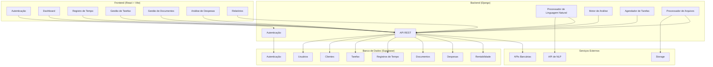

```mermaid
graph TD
    subgraph "Frontend (React + Vite)"
        FE_AUTH[Autenticação]
        FE_DASH[Dashboard]
        FE_TIME[Registro de Tempo]
        FE_TASK[Gestão de Tarefas]
        FE_DOC[Gestão de Documentos]
        FE_EXPENSE[Análise de Despesas]
        FE_REPORT[Relatórios]
    end

    subgraph "Backend (Django)"
        BE_API[API REST]
        BE_AUTH[Autenticação]
        BE_NLP[Processador de Linguagem Natural]
        BE_ANALYTIC[Motor de Análise]
        BE_SCHEDULER[Agendador de Tarefas]
        BE_FILEPROC[Processador de Arquivos]
    end

    subgraph "Banco de Dados (Supabase)"
        DB_AUTH[Autenticação]
        DB_USERS[Usuários]
        DB_CLIENTS[Clientes]
        DB_TASKS[Tarefas]
        DB_TIME[Registros de Tempo]
        DB_DOCS[Documentos]
        DB_EXP[Despesas]
        DB_PROF[Rentabilidade]
    end

    subgraph "Serviços Externos"
        SVC_NLP[API de NLP]
        SVC_BANK[APIs Bancárias]
        SVC_STORAGE[Storage]
    end

    %% Conexões Frontend-Backend
    FE_AUTH --> BE_AUTH
    FE_DASH --> BE_API
    FE_TIME --> BE_API
    FE_TASK --> BE_API
    FE_DOC --> BE_API
    FE_EXPENSE --> BE_API
    FE_REPORT --> BE_API

    %% Conexões Backend-Banco de Dados
    BE_AUTH --> DB_AUTH
    BE_API --> DB_USERS
    BE_API --> DB_CLIENTS
    BE_API --> DB_TASKS
    BE_API --> DB_TIME
    BE_API --> DB_DOCS
    BE_API --> DB_EXP
    BE_API --> DB_PROF

    %% Conexões Backend-Serviços
    BE_NLP --> SVC_NLP
    BE_API --> SVC_BANK
    BE_FILEPROC --> SVC_STORAGE

    %% Fluxos de Processamento
    BE_NLP --> BE_API
    BE_ANALYTIC --> BE_API
    BE_SCHEDULER --> BE_API
    BE_FILEPROC --> BE_API
```
